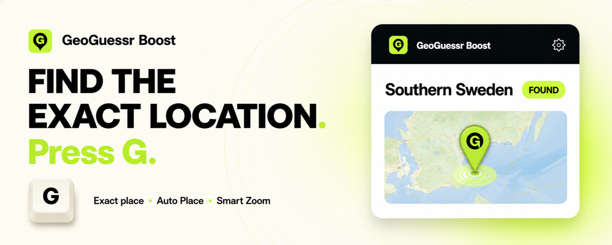
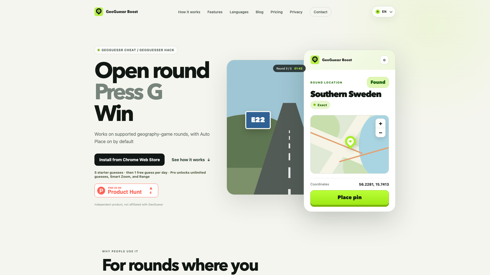

# GeoGuessr Cheat Extension — GeoBoost

  

  
  
  
  

**GeoBoost is a GeoGuessr cheat extension for Chrome that finds the exact location on supported geography-game rounds and can place the pin for you.** It combines exact coordinates, a map preview, readable place names, Auto Place, Smart Zoom and Range in one side panel.

The phrase “GeoGuessr cheat” is how many players search for this workflow. GeoBoost is built for agreed private games, practice, testing, party rounds and personal entertainment. It is not intended for ranked, tournament or public competitive play.

## Install GeoBoost

- **Chrome Web Store:** [Install GeoGuessr Boost in English](https://chromewebstore.google.com/detail/geoguessr-boost-geoguessr/offeainbmjpcckfpnbibokgblikpbchp?hl=en)
- **Official product page:** [GeoBoost for supported geography games](https://geoboost.win/)
- **Official product guide:** [GeoGuessr cheat extension — features, workflow and limitations](https://geoboost.win/)

No unpacked extension, script manager or API key is required for the published version.

## What the GeoGuessr cheat extension does

| Feature | What it does | Availability |
|---|---|---|
| Exact coordinates | Shows the current supported round point | Free and Pro |
| Readable location | Converts the point into a city, region or country label when available | Free and Pro |
| Map preview | Lets you review the result without opening another tab | Free and Pro |
| Auto Place | Places the pin on supported game maps | Free and Pro |
| Smart Zoom | Moves and zooms the map before the final placement | Pro |
| Range | Offsets the pin inside a selected score window | Pro |
| Configurable hotkey | Uses `G` by default and can be changed in settings | Free and Pro |
| Restore access | Restores paid access by email after reinstalling or changing browsers | Pro |

## Supported games

GeoBoost currently supports selected round workflows on:

- GeoGuessr
- OpenGuessr
- WorldGuessr
- FreeGuessr
- Geotastic

Each game exposes different pages and map controls, so feature availability can vary by mode. See the [supported-games notes](docs/SUPPORTED-GAMES.md) and the public [testing methodology](https://geoboost.win/testing-methodology).

## How it works

1. [Install GeoBoost from the Chrome Web Store](https://chromewebstore.google.com/detail/geoguessr-boost-geoguessr/offeainbmjpcckfpnbibokgblikpbchp?hl=en).
2. Open a supported private, practice or testing round.
3. Press `G`, or use your configured hotkey.
4. Review the location, coordinates and map preview in the Chrome side panel.
5. Place the pin manually, or use Auto Place when helper tools are allowed in the round.

The free tier includes five starter guesses and then one free guess per day. Pro unlocks unlimited use, Smart Zoom and Range.

## Product preview

  

## Why use a browser extension?

A website-only location tool adds extra tabs, copying and map switching. GeoBoost keeps the result next to the active round in Chrome. The shortest supported workflow is:

> Open a round → press G → review the map point → place the pin.

This makes the extension useful for private reveals, party rounds, product testing and practice sessions where you want to compare your manual read with the actual location.

## Privacy and permissions

GeoBoost uses Chrome Manifest V3 and requests access only to its supported game sites and the services required for the product workflow. The extension does not store third-party API keys. Screenshots are not sent for AI analysis.

Read the complete [privacy and permissions summary](docs/PRIVACY-AND-PERMISSIONS.md) and the official [Privacy Policy](https://geoboost.win/privacy).

## Languages

The interface supports:

`English` · `Français` · `Deutsch` · `Русский` · `Polski` · `Español` · `Português` · `Nederlands` · `Svenska`

English is the default language.

## Frequently asked questions

### Is GeoBoost a GeoGuessr cheat or hack?

GeoBoost provides the result people usually mean when searching for a GeoGuessr cheat: it can reveal the exact point on supported rounds and place the pin. The product is intended for private, practice, testing and party contexts where helper tools are allowed.

### Does it work in ranked or tournament play?

Ranked, tournament and public competitive modes are outside the intended and tested use of GeoBoost. Follow the rules of the game, lobby, event, school or workplace you are participating in.

### Does GeoBoost work on every round?

No. It works only when the current game, page and round format are supported. Game-site updates can temporarily affect detection or map controls.

### Is this repository the extension source code?

No. This is the official public documentation and media repository for GeoBoost. The production extension is distributed through the Chrome Web Store; its proprietary source code is not published here.

### Is GeoBoost affiliated with GeoGuessr?

No. GeoBoost is an independent product and is not affiliated with, endorsed by or sponsored by GeoGuessr.

## Documentation

- [Feature reference](docs/FEATURES.md)
- [Supported games and limitations](docs/SUPPORTED-GAMES.md)
- [Privacy and Chrome permissions](docs/PRIVACY-AND-PERMISSIONS.md)
- [Support](SUPPORT.md)
- [Security reporting](SECURITY.md)
- [Documentation contributions](CONTRIBUTING.md)

## About

GeoBoost is built and maintained by **GeoBoost Team**. Product-specific claims are checked against the current Chrome extension build on supported private or practice modes.

- Website: [geoboost.win](https://geoboost.win/)
- About: [About GeoBoost and its founder](https://geoboost.win/about)
- Contact: [support@geoboost.win](mailto:support@geoboost.win)

---

**Current documented version:** 1.0.5 · **Last documentation review:** August 10, 2026

GeoGuessr and related names are trademarks of their respective owners. This repository contains public product documentation and media only. All product rights are reserved by GeoBoost.
